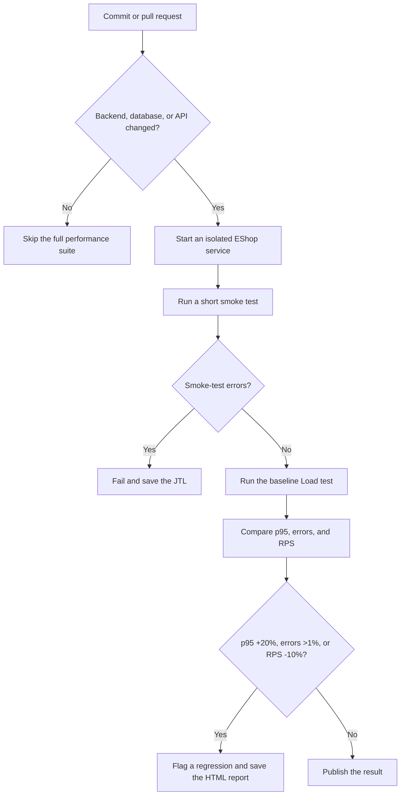

# HW05 — AI-assisted Performance Testing

Student ID: 23127081

Full name: Nguyễn Phan Hùng Linh

Test date: 2026-08-16

Repository: <https://github.com/linhnph05/hw05>

## 1. Purpose

This report explains how I designed, ran, and reviewed performance tests for
the EShop backend. I used Apache JMeter for three scenarios: Load, Stress, and
Spike. I also ran a ten-minute endurance test. An AI assistant helped with the
first design and result analysis, but I checked the plans and raw results
myself.

The report follows the same order as my work:

1. choose the endpoint scope;
2. review the AI design;
3. prepare the final JMeter plans and test data;
4. run the tests and monitor the backend;
5. review the measured results;
6. check the AI analysis; and
7. propose continuous performance testing.

## 2. System and test environment

| Item | Value |
| --- | --- |
| System under test | EShop Node.js, Express, and SQLite backend |
| Base URL | `http://127.0.0.1:3000` |
| Load-testing tool | Apache JMeter 5.6.3 |
| Test mode | JMeter non-GUI mode |
| Resource monitoring | macOS `ps`, once per second for the backend process |
| Computer | MacBook Pro (MacBookPro17,1), Apple M1, 8 CPU cores, 16 GB RAM |
| Operating system | macOS 15.7.3 |
| AI assistant | Codex / GPT-5.6 |

I used non-GUI mode because the JMeter GUI can use extra CPU and memory. The
measured resource data belongs to `/opt/homebrew/bin/node server.js`, which was
the backend process.

## 3. Step 1 — Choose the test scope

HW05 requires three endpoint groups: read-heavy, auth-heavy, and
transactional. I used one group for each test type. I chose a workflow of
three endpoints inside each group.

| Test | Endpoint group | Workflow |
| --- | --- | --- |
| Load | Read-heavy | `GET /api/cart` → `GET /api/orders/my-orders` → `GET /api/orders/{id}` |
| Stress | Auth-heavy | `POST /api/register` → `POST /api/forgot-password` → `POST /api/reset-password` |
| Spike | Transactional | `POST /api/apply-coupon` → `POST /api/admin/coupons` → `DELETE /api/admin/coupons/{id}` |

The Load workflow contains only read requests. The Stress workflow performs a
complete password life cycle. It does not use login, so the three-failed-login
lockout is not triggered. The Spike workflow applies a coupon, creates a
temporary coupon, and deletes that coupon. This limits permanent database
changes.

## 4. Step 2 — Review the AI test design

I first asked the AI to suggest endpoints, user counts, ramp-up times, test
durations, and report views. The first answer used one endpoint in each
scenario. This meets the endpoint-group rule, but I chose a broader workflow
with three endpoints in each scenario.

The AI also suggested up to 50 users for the Stress test. I started with 30
users because the test writes to a local SQLite database on a student laptop.
I used smoke tests before the measured runs.

My final changes to the AI design were:

- add a separate CSV file for every scenario;
- add HTTP status assertions;
- extract the password-reset token in the Stress workflow;
- extract and delete the temporary coupon in the Spike workflow;
- use three different JMeter listener types; and
- reduce the first Stress run from 50 users to 30 users.

The full AI prompts, answers, and my review are in `AI_Audit_Report.md`.

## 5. Step 3 — Prepare the final test plans

| Test plan | CSV input | JMeter report view | Main parameters |
| --- | --- | --- | --- |
| `23127081_Load_20260816.jmx` | `test-data/read_input.csv` | Summary Report | 20 users, 60-second ramp-up, 300 seconds, 1-second think time |
| `23127081_Stress_20260816.jmx` | `test-data/auth_input.csv` | Aggregate Report | 30 users, 60-second ramp-up, 180 seconds, 500 ms think time |
| `23127081_Spike_20260816.jmx` | `test-data/transaction_input.csv` | View Results Tree | 2 → 30 → 2 users, three 60-second stages |

Each plan reads its own CSV file. The three listener types are different, as
required. For the real measurements, the raw JTL and generated HTML dashboard
are the main evidence.

## 6. Step 4 — Run the tests

Before every run, I started the EShop backend, found the backend PID, and
started one-second CPU and RSS sampling. I then ran JMeter from the repository
root. The important options are:

- `-n`: run without the JMeter GUI;
- `-t`: select the JMeter plan;
- `-l`: save the raw JTL file;
- `-j`: save the JMeter log; and
- `-e -o`: generate the HTML report.

### 6.1 Load command

```sh
jmeter -n -t test-plans/23127081_Load_20260816.jmx -l results/load.jtl -e -o results/load_html -j results/load_jmeter.log
```

### 6.2 Stress command

```sh
jmeter -n -t test-plans/23127081_Stress_20260816.jmx -l results/stress.jtl -e -o results/stress_html -j results/stress_jmeter.log
```

### 6.3 Spike commands

The Spike test has baseline, high-load, and recovery stages.

```sh
jmeter -n -t test-plans/23127081_Spike_20260816.jmx -l results/spike_baseline.jtl -e -o results/spike_baseline_html -j results/spike_baseline_jmeter.log -Jspike_threads=2 -Jspike_ramp=1 -Jspike_stage_duration=60
jmeter -n -t test-plans/23127081_Spike_20260816.jmx -l results/spike.jtl -e -o results/spike_html -j results/spike_jmeter.log -Jspike_threads=30 -Jspike_ramp=5 -Jspike_stage_duration=60
jmeter -n -t test-plans/23127081_Spike_20260816.jmx -l results/spike_recovery.jtl -e -o results/spike_recovery_html -j results/spike_recovery_jmeter.log -Jspike_threads=2 -Jspike_ramp=1 -Jspike_stage_duration=60
```

I combined the three stage results in time order for the submitted
`results/spike.jtl`. The stage summary is in `results/spike_execution.md`.

### 6.4 Endurance command

I reused the Load workflow with 100 users for 600 seconds.

```sh
jmeter -n -t test-plans/23127081_Load_20260816.jmx -l results/endurance.jtl -e -o results/endurance_html -j results/endurance_jmeter.log -Jload_threads=100 -Jload_ramp=60 -Jload_duration=600
```

## 7. Step 5 — Review the measured results

### 7.1 Response results

| Run | Samples | Throughput | Mean | p95 | Maximum | Errors |
| --- | ---: | ---: | ---: | ---: | ---: | ---: |
| Load | 5,348 | 17.8 RPS | 8.56 ms | 30 ms | 178 ms | 0.00% |
| Stress | 8,522 | 47.3 RPS | 25.06 ms | 139 ms | 648 ms | 0.00% |
| Spike baseline | 230 | 3.83 RPS | 10.43 ms | 36 ms | 139 ms | 0.00% |
| Spike high load | 3,255 | 54.25 RPS | 23.37 ms | 103 ms | 622 ms | 0.00% |
| Spike recovery | 226 | 3.77 RPS | 14.84 ms | 40 ms | 377 ms | 0.00% |

The Load test was stable at its planned traffic. The Stress test had a higher
p95 than Load because it performed database writes, but it still completed
without errors. During the Spike test, p95 increased to 103 ms at 30 users and
returned to 40 ms in recovery. This shows that the backend recovered after the
short traffic increase.

### 7.2 Backend resource results

| Run | Average CPU | Peak CPU | Average RSS | Peak RSS |
| --- | ---: | ---: | ---: | ---: |
| Load | 1.99% | 17.3% | 33,530 KB | 45,744 KB |
| Stress | 9.17% | 24.6% | 42,382 KB | 64,304 KB |
| Spike | 3.72% | 18.0% | 34,357 KB | 63,664 KB |

Stress used the most average CPU because registration and password reset write
to SQLite. No measured run crashed, and all runs had a 0.00% error rate. I did
not find a performance issue from these runs.

### 7.3 HTML dashboard evidence

I opened the generated JMeter dashboards in Chrome. These images show the
rendered HTML reports from the raw JTL files.


## 8. Step 6 — Determine the endurance threshold

The endurance test ran for ten minutes with 100 users, a 60-second ramp-up,
and a one-second think time. It completed 55,622 samples. The measured results
were:

- throughput: **92.70 RPS** using the planned 600-second duration;
- mean response time: **19.04 ms**;
- p95 response time: **83 ms**;
- maximum response time: **1,031 ms**;
- errors: **0.00%**;
- backend peak CPU: **26.9%**; and
- backend peak RSS: **76,000 KB**.

Therefore, the tested stable level on this computer is **at least 92.70 RPS
for ten minutes at 100 users**. This is not the absolute maximum capacity. The
backend still had CPU headroom, and I did not increase traffic until failure.

## 9. Step 7 — Check the AI result analysis

After the tests, I asked the AI to analyse the raw JTL and resource CSV files.
I then recalculated the important values.

The AI reported a merged Spike p95 of 97 ms and a high-load-stage p95 of 105
ms. My direct check of the raw data gave **93 ms** for the merged JTL and **103
ms** for the high-load stage. The difference probably came from the percentile
position or from mixing the merged and stage files.

The AI calculated endurance throughput as 92.89 RPS from the observed time
window. I report 92.70 RPS because I divide 55,622 samples by the planned 600
seconds. Both calculations describe the same stable run, but neither proves an
absolute hardware limit.

### 9.1 Review of AI recommendations

| AI recommendation | My decision | Reason |
| --- | --- | --- |
| Add an index on `orders(user_id, id)` | Feasible experiment | The order-history query filters by `user_id` and sorts by ID. Measure before and after. |
| Add an index on `users(email)` | Feasible experiment | Register and password-reset operations use email lookup. |
| Enable SQLite WAL | Feasible experiment | It may improve concurrent writes, but the current results do not prove that it is needed. |
| Add a normal database connection pool | Unsuitable | This SUT uses one local SQLite connection, not a remote database server. |
| Add caching now | Not supported by evidence | CPU was low and there were no errors. A slow query should be identified first. |

## 10. Step 8 — Continuous performance testing proposal



The short smoke and Load tests should run when a pull request changes backend,
database, or API code. Stress and endurance tests should run nightly or before
a release because they take more time.

There are two main trade-offs. First, long tests use more CI time and money.
Second, a busy shared runner may create a false alarm. To reduce false alarms,
the pipeline should use fixed test data and the same runner type. It should
also repeat a failed performance comparison before blocking a release.

## 11. Conclusion

I completed the Load, Stress, Spike, and endurance runs with raw JTL files,
resource CSV files, JMeter logs, HTML reports, and dashboard screenshots. All
measured runs had 0.00% errors. The strongest tested stable result was 92.70
RPS for ten minutes with 100 users, p95 83 ms, and backend peak RSS 76,000 KB.

The AI helped create a first plan and analyse the results, but it did not own
the final answer. I changed the plan for the local environment and checked the
important metrics from the raw files. The separate 200–300 word critique is in
`AI_Critique.md`. The AI interaction record is in `AI_Audit_Report.md`.

No video was recorded, as instructed. `Video_Narration_and_Steps.md` contains
the Vietnamese narration and recording steps.
