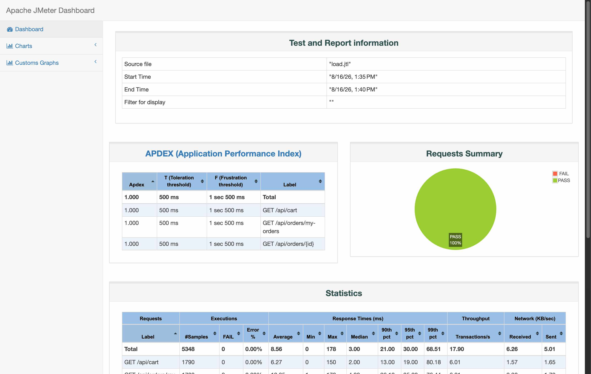
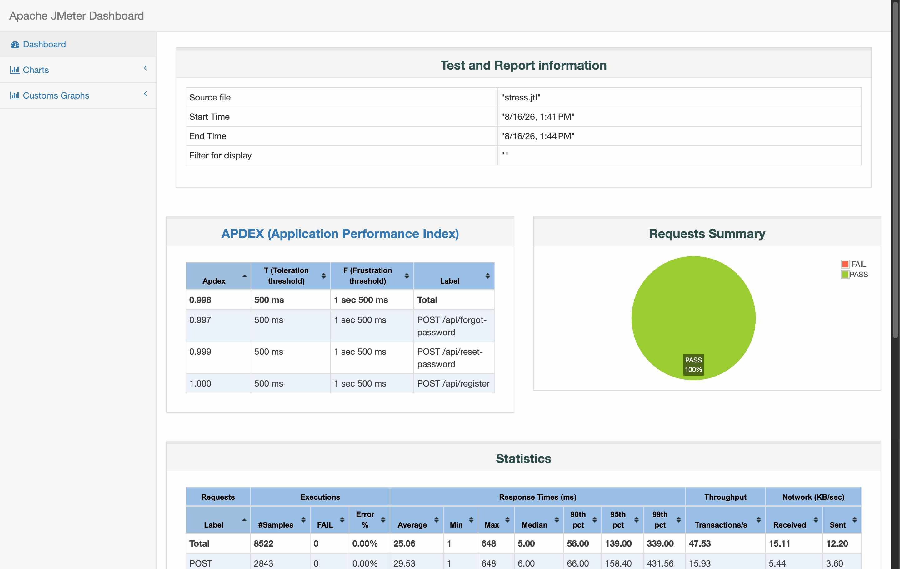
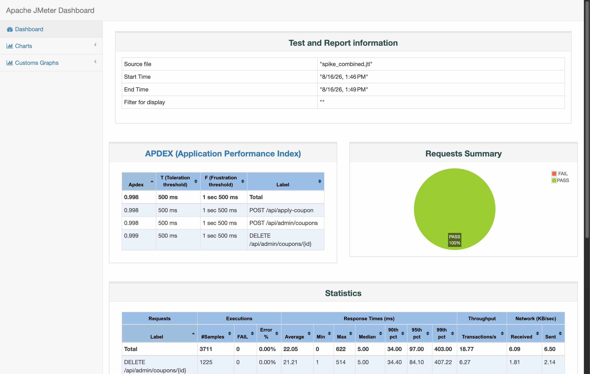
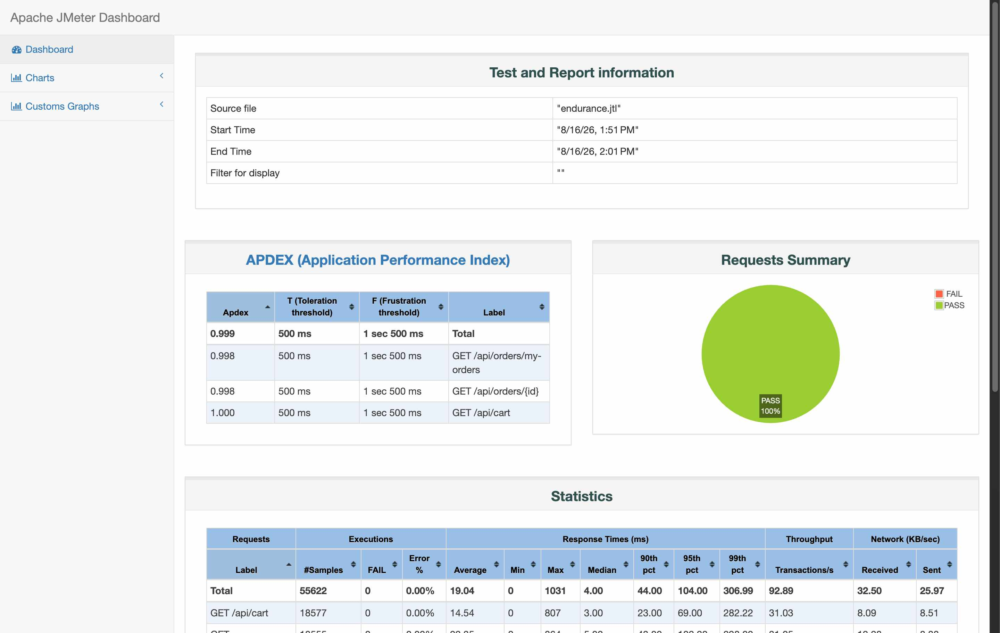
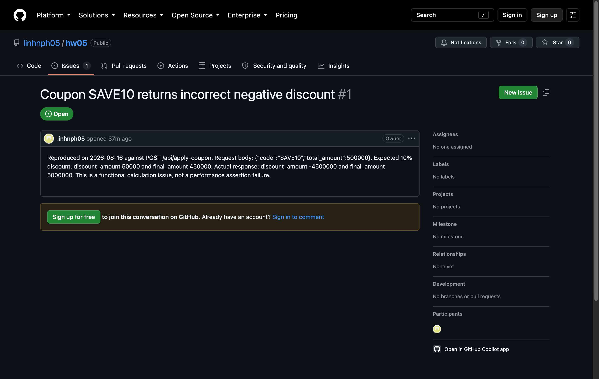
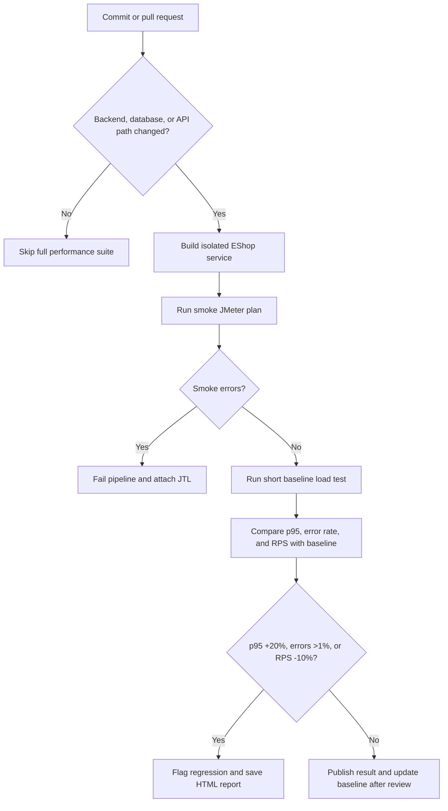

# HW05 — AI-assisted Performance Testing

Student ID: 23127081  
Full name: 23127081  
Date: 2026-08-16  
Repository: <https://github.com/linhnph05/hw05>

## Tools and environment

| Item | Value |
| --- | --- |
| SUT | EShop Node.js + Express + SQLite backend at `http://127.0.0.1:3000` |
| Load tool | Apache JMeter 5.6.3, non-GUI mode |
| Resource monitor | macOS `ps`, sampled once per second for the backend PID |
| Hardware | MacBook Pro (MacBookPro17,1), Apple M1, 8 CPU cores, 16 GB memory |
| OS | macOS 15.7.3 |
| AI assistance | A second Codex/GPT-5.6 agent; full log in `AI_Audit_Report.md` |

I used JMeter non-GUI mode for the measured runs. This avoids using the GUI
listener as a load generator. The raw JTL files, JMeter HTML reports, JMeter
logs, and resource CSV files are in `results/`.

## JMeter HTML report screenshots

I opened the generated JMeter HTML dashboards in Chrome and captured the
visible dashboard summaries. These screenshots are copies of the rendered
reports, not recreated result tables.

## Endpoint scope

I avoided my teammate's selected endpoints: product search/detail, login, and
cart/checkout. I selected three endpoints in each scenario.

| Scenario and plan | Endpoint group | Endpoint workflow | CSV input | Listener/report view |
| --- | --- | --- | --- | --- |
| Load — `23127081_Load_20260816` | Read-heavy | `GET /api/cart` → `GET /api/orders/my-orders` → `GET /api/orders/{id}` | `test-data/read_input.csv` | Summary Report |
| Stress — `23127081_Stress_20260816` | Auth-heavy | `POST /api/register` → `POST /api/forgot-password` → `POST /api/reset-password` | `test-data/auth_input.csv` | Aggregate Report |
| Spike — `23127081_Spike_20260816` | Transactional | `POST /api/apply-coupon` → `POST /api/admin/coupons` → `DELETE /api/admin/coupons/{id}` | `test-data/transaction_input.csv` | View Results Tree |

Each plan has status-code assertions. The stress plan extracts the reset token
from the forgot-password response before calling reset-password. The spike plan
extracts the temporary coupon ID and deletes the temporary coupon, so its
write test cleans up after itself.

## AI design and my review

I first asked the AI for endpoint and parameter ideas. It suggested one
endpoint for each scenario. I corrected this because the assignment requires
three endpoints for each scenario. I also added the CSV files, HTTP assertions,
reset-token extractor, and distinct JMeter listeners.

The AI proposed a 50-user stress run. I used 30 users for the first real stress
run because this is a student laptop and the SUT writes to one SQLite database.
The final parameters were based on actual smoke tests, not only on the AI
answer. The complete prompts and responses are in the audit report.

## Measured results

| Run | Parameters | Samples | Throughput | Mean | p95 | Maximum | Errors |
| --- | --- | ---: | ---: | ---: | ---: | ---: | ---: |
| Load | 20 users, 60 s ramp, 300 s duration, 1 s think time | 5,348 | 17.8 RPS | 8.56 ms | 30 ms | 178 ms | 0.00% |
| Stress | 30 users, 60 s ramp, 180 s duration, 500 ms think time | 8,522 | 47.3 RPS | 25.06 ms | 139 ms | 648 ms | 0.00% |
| Spike baseline | 2 users, 1 s ramp, 60 s duration | 230 | 3.83 RPS | 10.43 ms | 36 ms | 139 ms | 0.00% |
| Spike | 30 users, 5 s ramp, 60 s duration | 3,255 | 54.25 RPS | 23.37 ms | 103 ms | 622 ms | 0.00% |
| Spike recovery | 2 users, 1 s ramp, 60 s duration | 226 | 3.77 RPS | 14.84 ms | 40 ms | 377 ms | 0.00% |

The spike test used three time-ordered stages. I merged their raw stage JTL
files into `results/spike.jtl`; `results/spike_execution.md` records each
stage. The temporary stage files are in `trash/` and are not submission files.

### Resource use

| Run | Average CPU | Peak CPU | Average RSS | Peak RSS |
| --- | ---: | ---: | ---: | ---: |
| Load | 1.99% | 17.3% | 33,530 KB | 45,744 KB |
| Stress | 9.17% | 24.6% | 42,382 KB | 64,304 KB |
| Spike | 3.72% | 18.0% | 34,357 KB | 63,664 KB |

`ps` monitored the actual `/opt/homebrew/bin/node server.js` backend process,
not the JMeter process. This is why the backend CPU values are modest even when
the test generator uses many threads.

## Endurance threshold

I ran the read workflow for 10 minutes with 100 users, a 60-second ramp, and a
one-second think time. The run completed 55,622 samples at **92.70 RPS**, with
mean 19.04 ms, p95 83 ms, maximum 1,031 ms, and 0.00% errors. Backend peak CPU
was 26.9% and peak RSS was 76,000 KB.

Therefore, the measured stable level on this machine is **at least 92.70 RPS
for ten minutes at 100 users**. It is not an absolute hardware maximum: the
backend still had CPU headroom and I did not run the machine until it failed.

## Issue found

I reproduced a functional defect in the coupon calculation and reported it as
[GitHub Issue #1](https://github.com/linhnph05/hw05/issues/1). For
`POST /api/apply-coupon` with `SAVE10` and `total_amount` 500000, the expected
discount is 50,000 and final amount is 450,000. The actual response was
`discount_amount: -4500000` and `final_amount: 5000000`. This is a functional
calculation bug. The JTL only proves that the endpoint returned HTTP 200; the
separate API response reproduction proves the defect.

## AI analysis and misinterpretation hunt

The second AI calculated useful results and proposed performance gates. I
checked the raw JTL values myself. One small metric error was found: it reported
the merged spike p95 as 97 ms and the spike-stage p95 as 105 ms. Sorting the
raw elapsed values in `results/spike.jtl` gives a merged p95 of **93 ms**; the
spike-stage raw file gives **103 ms**. The error likely came from a percentile
index or rounding choice. I use my direct raw-JTL values in this report.

The AI correctly warned that 92.89 RPS must not be called the hardware limit.
My own calculation is 92.70 RPS because I divide the 55,622 samples by the
planned 600-second run duration. These are different denominator choices, not
evidence of a regression.

| AI recommendation | My judgement | Reason |
| --- | --- | --- |
| Add index on `orders(user_id, id)` | Feasible | The order-history query filters by `user_id` and sorts by ID. Measure query plans before changing it. |
| Add index on `users(email)` | Feasible | Register, forgot-password, and login use email lookup. |
| Enable SQLite WAL | Feasible experiment | It may help concurrent writes, but these runs do not prove a need. Measure before and after. |
| Add a normal connection pool | Hallucinated / unsuitable | This SUT uses one local SQLite connection, not a remote database service. |
| Add caching now | Not justified | CPU is low and there were no errors. First identify a slow database query. |

## Continuous performance testing proposal

Run the smoke test on every relevant pull request. Run the longer stress and
endurance suites nightly or before release, because they cost more time and
compute. A p95 comparison can find a slow change early, but it can also cause
false alarms when a shared CI runner is busy. To reduce false alarms, run the
same plan twice before failing a release and keep the test data and hardware
class fixed. This model costs CI minutes and test-database resets, but it gives
the team a performance history instead of discovering regressions after merge.

## AI critique

See `AI_Critique.md` for the required 200–300 word critique.

## Video note

No video was recorded, as instructed. `Video_Narration_and_Steps.md` gives a
Vietnamese narration script and exact recording steps for a later recording.
